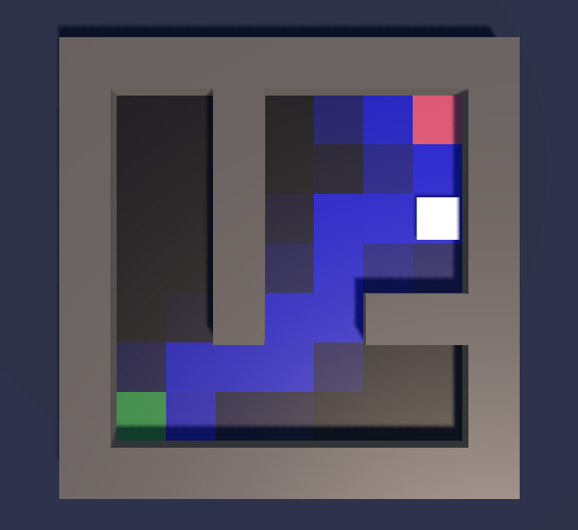
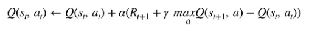

# RL Maze (WIP)

An reinforcement learning project to learn the fundamentals and underlying algorithms behind my favourite form of AI.

This project makes use of **Q-learning** - a tabular algorithm which (funnily enough) creates and updates a table of values for each state/action pair. It doesn't scale particularly well if there are a lot of potential actions or complex states, but is really accessible for getting started.

## Contents

[- Screenshots](#screenshots)

[- How It Works](#how-it-works)

[- Todo](#todo)

[- The Q-Learning Algorithm](#the-q-learning-algorithm)

## Screenshots

## How It Works

The agent's goal is to find the goal.

The agent has a list of possible **actions**: [up, down, left, right]

The agent has a **state**: [x, y] describing it's position on a 2D grid.

When the agent finds the goal, it will restart at the start location. This is defined as an **episode**.

The agent will receive and then remember rewards for different situations. For example:

- reaching the goal: 10
- hitting a wall: -1
- taking a step: -0.1
- hitting a hazard: -5

To start with, the agent's movement will be completely random (**epsilon** at value 1). After each episode, this randomness will decay and rely more apon it's knowledge of rewards for each action at a given state.

# Todo

- refactor Q-Learning script to a monobehavior to enable simultaneous agents. ✅
- add a UI to display parameters.
- add functionality to export Q-table data.

## The Q-Learning Algorithm

This took me so much time to understand. I'm still not 100% sure I can explain it properly.

**Q = Q-value** The quality score.

**Q(s,a) = The Q-value of a state and action pair.**

**s = current state**. In this project, position on the grid.

**a = action**. All the possible actions an agent can make.

**α = alpha**. How quickly the agent learns, or the degree to which an action influences future decisions (0-1).

**r = reward**. The reward for an action in the current state.

**γ = gamma**. The discount factor. How much does the agent value future rewards (1) over immediate rewards (0)? Or, the battle between watching YT shorts about RL learning vs. actually finishing this project.
